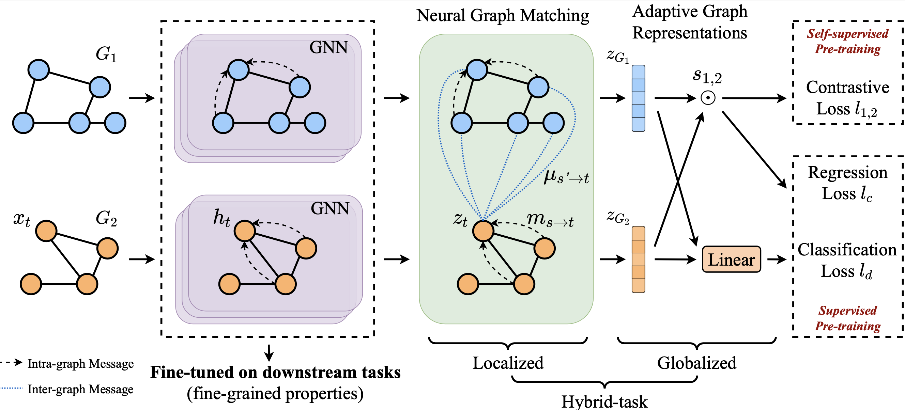

# GMPT

Official PyTorch implementation for **G**raph **M**atching based GNN **P**re-**T**raining [[paper]](https://arxiv.org/abs/2203.01597).

> *Yupeng Hou, Binbin Hu, Wayne Xin Zhao, Zhiqiang Zhang, Jun Zhou, Ji-Rong Wen.* **Neural Graph Matching for Pre-training Graph Neural Networks.** SDM 2022.

## Overview



## Requirements

```
python              3.7.7
pytorch             1.7.1
torch-geometric     1.6.3
cudatoolkit         10.1
rdkit               2020.09.1.0
```

## Quick Start

Fine-tune with pre-trained GMPT-CL model on Bio

```bash
bash scripts/bio.sh
```

Pre-train from scratch

```bash
bash scripts/bio.sh pretrain
```

Check the results

```bash
python result_analysis.py --mode bio
```

For more detailed and customized usage, e.g., change datasets, GNN types, pre-trained models et al., please kindly refer to [bio.sh](scripts/bio.sh) and [chem.sh](scripts/chem.sh).

## Datasets

Please refer to [dataset-download](https://github.com/snap-stanford/pretrain-gnns#dataset-download) to download `Bio` and `Chem` datasets.

Then the downloaded datasets should be moved to `dataset/`.

## Pre-trained models

You can download the pre-trained GNN models from [Google Drive](https://drive.google.com/drive/folders/134a0bT5LRQDbjolls1GjXC_sHhvUF0Fe?usp=sharing) and move them to `bio_pretrain_model` and `chem_pretrain_model`.

## Acknowledgement

The implementation is reference to [pretrain-gnns](https://github.com/snap-stanford/pretrain-gnns) (backbone) and [GraphCL](https://github.com/Shen-Lab/GraphCL/tree/master/transferLearning_MoleculeNet_PPI) (augmentation).

If you use this code for your research, please cite the following paper.

```
@inproceedings{hou2022gmpt,
  author = {Yupeng Hou and Binbin Hu and Wayne Xin Zhao and Zhiqiang Zhang and Jun Zhou and Ji-Rong Wen},
  title = {Neural Graph Matching for Pre-training Graph Neural Networks},
  booktitle = {{SDM}},
  year = {2022}
}
```
